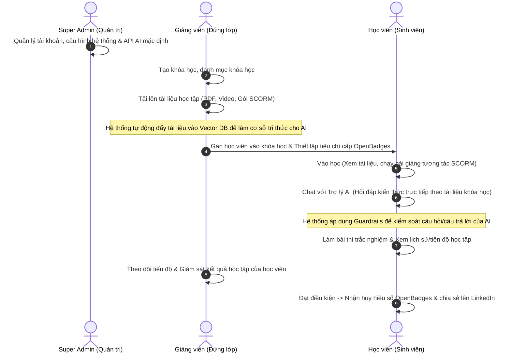

# ĐẶC TẢ NGHIỆP VỤ CHI TIẾT CỦA 3 VAI TRÒ (ROLES) BÁM SÁT ĐỀ CƯƠNG TTTN
**Đề tài:** Hệ thống quản lý học tập trực tuyến (LMS) tích hợp Trợ lý AI hỗ trợ học tập.

**3 vai trò (Roles) cốt lõi**: **Super Admin**, **Giảng viên (Teacher)**, và **Học viên (Student)**. 

## SƠ ĐỒ PHỐI HỢP NGHIỆP VỤ (WORKFLOW)

Quy trình phối hợp giữa 3 vai trò trong một chu kỳ học tập tích hợp AI:

---

## PHÂN BỔ NGHIỆP VỤ CHI TIẾT BÁM SÁT ĐỀ CƯƠNG

Dưới đây là cách ánh xạ các yêu cầu thực hành trong đề cương vào chức năng nghiệp vụ của 3 vai trò:

## VAI TRÒ: SUPER ADMIN (QUẢN TRỊ HỆ THỐNG)
*Bám sát yêu cầu: "Quản lý tài khoản người dùng" & "Xây dựng chức năng quản trị hệ thống".*

*   **Quản lý người dùng:** Tạo mới, phê duyệt, khóa hoặc xóa tài khoản của Giảng viên và Học viên trên hệ thống.
*   **Reset mật khẩu cho người dùng:** Khi người dùng quên mật khẩu, hệ thống gửi email chứa link reset (token lưu trên Redis, hết hạn sau 15 phút). Admin cũng có thể reset thủ công.
*   **Giám sát hệ thống:** Xem thống kê tổng quan (số lượng khóa học, số lượng học viên đang hoạt động, lượng tài nguyên lưu trữ đã sử dụng).
*   **Cấu hình kỹ thuật:** Quản lý cấu hình API kết nối với LLM (Gemini API), giới hạn chat AI (mặc định: **50 lượt/ngày** cho mỗi học viên), và kiểm soát tài nguyên máy chủ.

---

## VAI TRÒ: GIẢNG VIÊN (TEACHER)
*Bám sát yêu cầu: "Quản lý khóa học/danh mục", "Quản lý bài học/tài liệu", "Theo dõi tiến độ học viên", "Quản lý kết quả/lịch sử học tập", và "Xây dựng cơ sở tri thức từ nội dung khóa học".*

*   **Quản lý Khóa học & Danh mục:** Tạo mới khóa học, phân loại khóa học vào các danh mục (ví dụ: Công nghệ thông tin, Kinh tế...). Hỗ trợ tìm kiếm khóa học theo tên/mô tả (full-text search tiếng Việt).
*   **Quản lý Bài học & Học liệu (Cơ sở tri thức AI):**
    *   Tạo các chương mục, bài học nhỏ cho khóa học.
    *   Tải lên các định dạng học liệu: Video, tài liệu PDF, bài giảng tương tác chuẩn **SCORM**.
    *   **Giới hạn kích thước file upload:** PDF tối đa **10MB**, Video tối đa **100MB**, gói SCORM tối đa **30MB**.
    *   **Xây dựng cơ sở tri thức cho AI:** Khi giảng viên tải tài liệu học tập (PDF/Text) lên, hệ thống sẽ tự động kích hoạt tiến trình vector hóa tài liệu này và lưu vào Vector Database để làm dữ liệu nền cho Trợ lý AI.
*   **Hỗ trợ 1-1 qua Google Meet (On-demand Support):**
    *   Xem danh sách yêu cầu hỗ trợ từ học viên.
    *   Nhận yêu cầu hỗ trợ, nhập link Google Meet và thời gian hẹn → hệ thống **đẩy thông báo real-time** qua WebSocket cho học viên (hiển thị popup ngay lập tức trên giao diện).
    *   Ghi chú giải pháp sau khi hoàn tất hỗ trợ.
*   **Theo dõi & Giám sát học viên:**
    *   Xem báo cáo tiến độ học tập chi tiết của từng học viên (đã học bài nào, hoàn thành bao nhiêu phần trăm).
    *   Xem lịch sử điểm số và lịch sử hội thoại của học viên với Trợ lý AI (để nắm bắt xem học viên đang gặp khó khăn ở phần kiến thức nào).

---

## VAI TRÒ: HỌC VIÊN (STUDENT)
*Bám sát yêu cầu: "Theo dõi tiến độ", "Quản lý kết quả/lịch sử", "Xây dựng trợ lý AI hỗ trợ học tập", và "Sinh phản hồi phù hợp với nội dung khóa học".*

*   **Học tập & Tương tác:**
    *   Vào khóa học, học các bài giảng bằng video/PDF hoặc tương tác trực tiếp trên slide bài giảng chuẩn **SCORM**.
    *   Hệ thống tự động ghi nhận tiến độ học (ví dụ: đã học xong bài 1, bài 2).
*   **Học tập cùng Trợ lý AI (RAG chatbot):**
    *   Trong quá trình học, học viên mở khung chat với Trợ lý AI.
    *   Đặt câu hỏi thắc mắc. AI sẽ truy xuất thông tin từ cơ sở tri thức (học liệu do Giảng viên upload ở khóa học đó) để sinh phản hồi chính xác, bám sát nội dung bài học.
    *   *Giới hạn sử dụng:* Mỗi học viên được phép chat tối đa **50 lượt/ngày** để kiểm soát chi phí gọi LLM.
    *   *Kiểm soát an toàn (Guardrails):* Câu hỏi và câu trả lời của học viên sẽ đi qua bộ lọc Guardrails của hệ thống để đảm bảo không vi phạm an toàn thông tin và không trả lời lạc đề môn học.
*   **Yêu cầu giảng viên hỗ trợ:**
    *   Gửi yêu cầu hỗ trợ kèm mô tả lỗi khi gặp bài giảng quá khó hoặc thi trượt.
    *   Nhận liên kết Google Meet từ giảng viên và bấm nút tham gia phòng họp 1-1 khi đến giờ hẹn.
*   **Đánh giá & Xem lịch sử:**
    *   Làm bài thi trắc nghiệm để hệ thống tự động chấm điểm.
    *   Xem tiến độ học tập của bản thân thông qua biểu đồ trực quan.
    *   Xem lịch sử kết quả thi cử, xem lại lịch sử chat với AI để ôn tập.
    *   Nhận và chia sẻ chứng chỉ số **OpenBadges** lên hồ sơ chuyên môn (LinkedIn).
*   **Thông báo real-time (Notifications):**
    *   Nhận thông báo đẩy ngay lập tức qua **WebSocket** khi: Giảng viên hẹn lịch Meet, tài liệu mới được thêm, huy hiệu được cấp, kết quả thi.
    *   Xem danh sách tất cả thông báo (đã đọc / chưa đọc) trên giao diện (icon chuông).
*   **Quên mật khẩu:**
    *   Yêu cầu reset mật khẩu qua email. Hệ thống gửi link reset có thời hạn **15 phút** (token lưu trên Redis).

---

## RÀNG BUỘC PHI CHỨC NĂNG (Non-Functional Requirements)

| # | Ràng buộc | Giá trị |
|---|-----------|--------|
| 1 | Giới hạn chat AI / học viên | **50 lượt/ngày** |
| 2 | Kích thước upload PDF | Tối đa **10 MB** |
| 3 | Kích thước upload Video | Tối đa **100 MB** |
| 4 | Kích thước upload SCORM | Tối đa **30 MB** |
| 5 | Reset password token TTL | **15 phút** (Redis) |
| 6 | Thông báo real-time | **WebSocket** (popup + icon chuông) |
| 7 | Tìm kiếm khóa học | **Full-text search** (PostgreSQL GIN + unaccent) |
| 8 | Soft Delete | Áp dụng cho bảng `users` và `courses` |