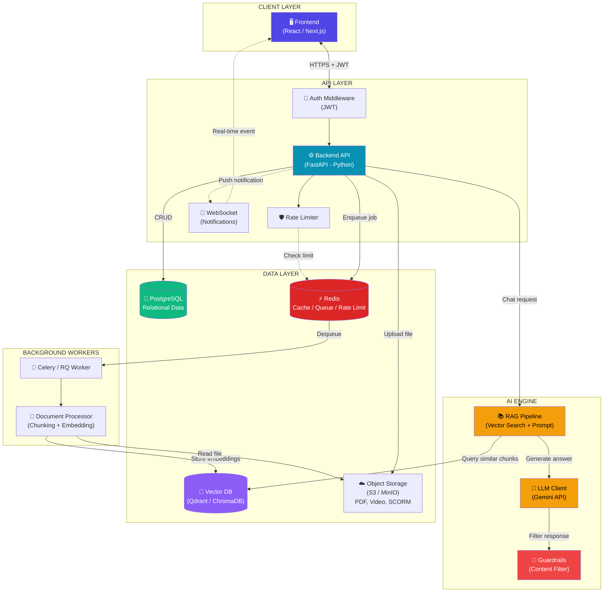
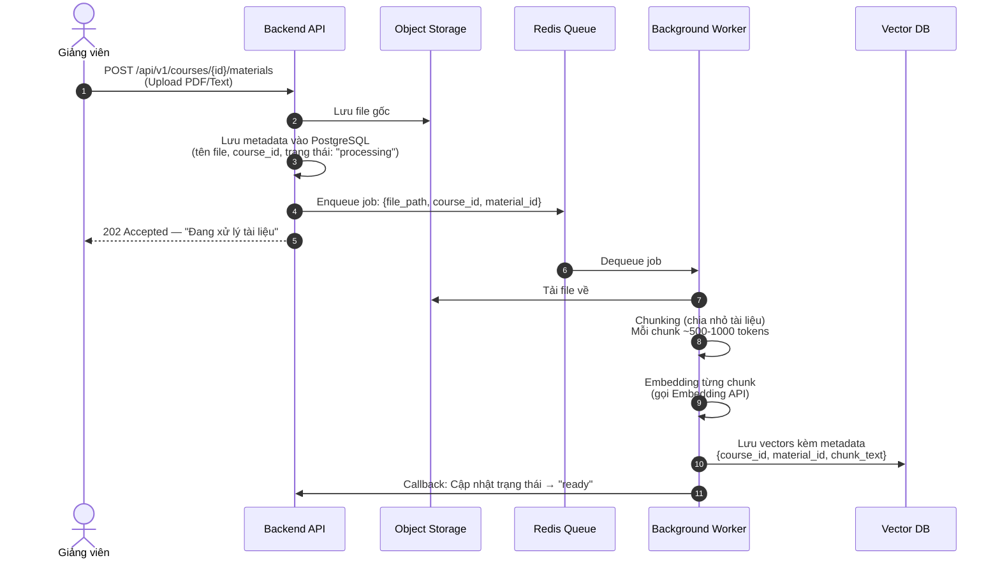
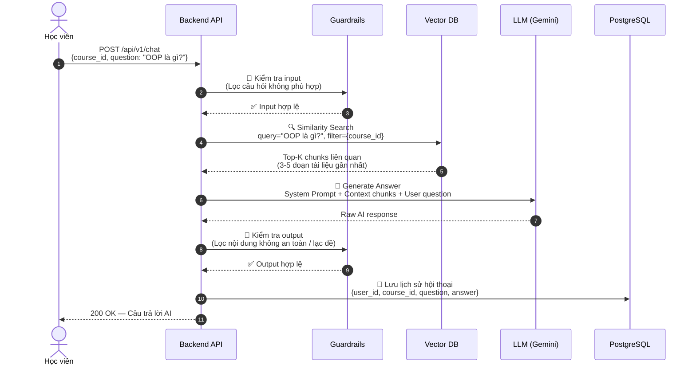
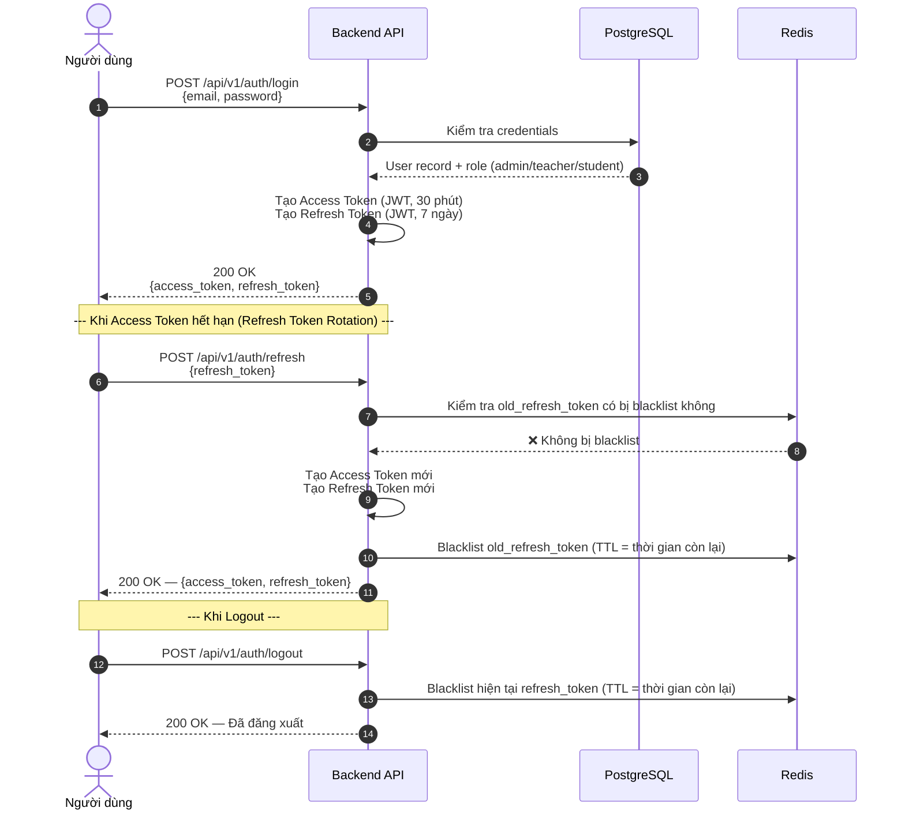
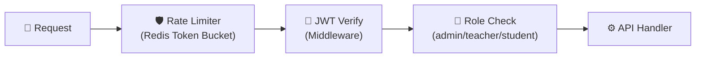
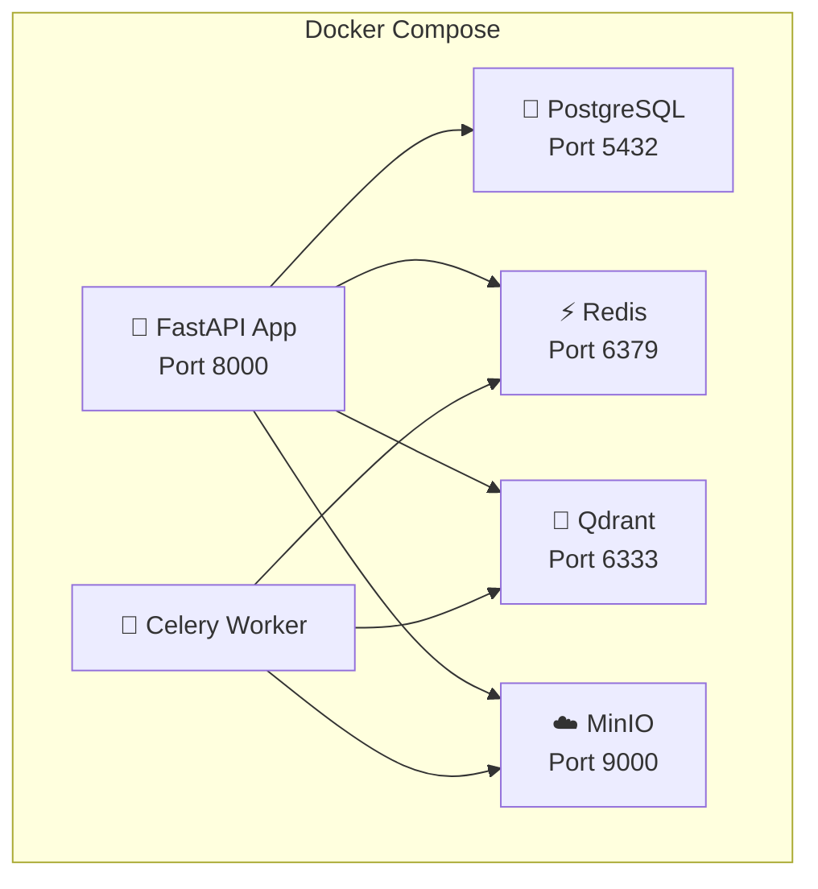
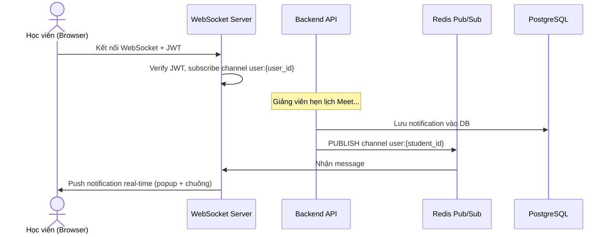

# 02 — KIẾN TRÚC HỆ THỐNG (System Architecture)

**Dự án:** Hệ thống quản lý học tập trực tuyến (LMS) tích hợp Trợ lý AI hỗ trợ học tập.

> Tài liệu này mô tả kiến trúc kỹ thuật tổng thể, luồng dữ liệu giữa các thành phần, và các quyết định thiết kế quan trọng — bám sát nghiệp vụ đã được xác định tại [01_business_requirements.md](./01_business_requirements.md).

---

## 1. SƠ ĐỒ KIẾN TRÚC TỔNG QUAN (High-Level Architecture)

Hệ thống áp dụng kiến trúc **Client-Server 3 tầng (3-Tier)** kết hợp **Pipeline xử lý AI bất đồng bộ**:



---

## 2. KIẾN TRÚC PHÂN LỚP BACKEND (Layered Architecture)

Backend được tổ chức theo mô hình **phân lớp (Layered)**, tách biệt rõ ràng giữa tầng API, nghiệp vụ, AI, và hạ tầng:

```
backend/
├── main.py                         # Entry point — Khởi tạo FastAPI app
├── requirements.txt                # Quản lý thư viện Python
│
└── app/
    ├── api/                        # 🔵 TẦNG GIAO TIẾP (Transport Layer)
    │   └── v1/                     #    Versioning API
    │       ├── courses.py          #    Endpoints: Khóa học, Danh mục, Bài học
    │       ├── users.py            #    Endpoints: Đăng ký, Đăng nhập, Quản lý User
    │       └── chat.py             #    Endpoints: Chat AI, Lịch sử hội thoại
    │
    ├── core/                       # 🟡 TẦNG CẤU HÌNH LÕI (Core Config)
    │   ├── config.py               #    Load biến môi trường (.env)
    │   ├── security.py             #    JWT encode/decode, password hashing
    │   └── rate_limiter.py         #    Token Bucket qua Redis
    │
    ├── models/                     # 🟢 TẦNG DỮ LIỆU (Data Models)
    │                               #    SQLAlchemy ORM models ↔ PostgreSQL
    │
    ├── services/                   # 🔴 TẦNG NGHIỆP VỤ (Business Logic)
    │   ├── course_service.py       #    Logic: CRUD khóa học, gán học viên, tiến độ
    │   └── auth_service.py         #    Logic: Xác thực, phân quyền, refresh token
    │
    ├── ai_engine/                  # 🟣 TẦNG AI (Cô lập hoàn toàn)
    │   ├── llm_client.py           #    Wrapper gọi LLM (Gemini, OpenAI...)
    │   ├── vector_store.py         #    Kết nối & query Vector DB
    │   ├── document_processor.py   #    Chunking tài liệu + Tạo embedding
    │   └── prompts/                #    System Prompt templates
    │       ├── student_chat_prompt.txt
    │       └── guardrails_prompt.txt
    │
    └── worker/                     # 🟠 TẦNG XỬ LÝ NỀN (Background Jobs)
        └── tasks.py                #    Nhận job từ Redis Queue, xử lý file
```

### Nguyên tắc thiết kế:

| Nguyên tắc | Mô tả |
|---|---|
| **Tách biệt AI** | Toàn bộ logic AI nằm trong `ai_engine/`, không phụ thuộc vào `services/` hay `api/` |
| **Service Layer** | `api/` chỉ parse request → gọi `services/` → trả response. Không chứa logic nghiệp vụ |
| **Dependency Injection** | Các service được inject qua constructor, dễ mock khi test |
| **Stateless API** | Không lưu session trên server. Mọi trạng thái xác thực qua JWT |

---

## 3. LUỒNG DỮ LIỆU CHÍNH (Core Data Flows)

### 3.1 Luồng Upload tài liệu & Xây dựng cơ sở tri thức AI

Khi **Giảng viên** upload tài liệu (PDF/Text), hệ thống tự động vector hóa để làm cơ sở tri thức cho AI chatbot:



### 3.2 Luồng Học viên Chat với Trợ lý AI (RAG Pipeline)

Khi **Học viên** đặt câu hỏi, hệ thống dùng kỹ thuật **RAG (Retrieval-Augmented Generation)** để trả lời bám sát nội dung khóa học:



### 3.3 Luồng Xác thực & Phân quyền (Authentication Flow)



---

## 4. THIẾT KẾ API ENDPOINTS (RESTful API Design)

### 4.1 Quy tắc chung

- **Base URL**: `/api/v1/`
- **Versioning**: Prefix `/v1/` để hỗ trợ nâng cấp API sau này
- **Auth**: Tất cả endpoint (trừ login/register) yêu cầu header `Authorization: Bearer <access_token>`
- **Phân quyền**: Dựa trên trường `role` trong JWT payload (`admin`, `teacher`, `student`)
- **Response format**: JSON chuẩn `{ "success": bool, "data": {...}, "message": "..." }`

### 4.2 Bảng tổng hợp Endpoints

#### 🔐 Authentication (`users.py`)

| Method | Endpoint | Quyền | Mô tả |
|--------|----------|-------|--------|
| POST | `/auth/register` | Public | Đăng ký tài khoản |
| POST | `/auth/login` | Public | Đăng nhập, nhận JWT |
| POST | `/auth/refresh` | Authenticated | Làm mới Access Token |
| POST | `/auth/logout` | Authenticated | Đăng xuất, blacklist token |

#### 👤 User Management (`users.py`)

| Method | Endpoint | Quyền | Mô tả |
|--------|----------|-------|--------|
| GET | `/users` | Admin | Danh sách users (phân trang, filter role) |
| GET | `/users/{id}` | Admin / Owner | Thông tin chi tiết user |
| PUT | `/users/{id}` | Admin / Owner | Cập nhật thông tin user |
| PATCH | `/users/{id}/status` | Admin | Khóa / Mở khóa tài khoản |
| DELETE | `/users/{id}` | Admin | Xóa tài khoản |
| GET | `/users/me` | Authenticated | Thông tin user hiện tại |

#### 📚 Courses (`courses.py`)

| Method | Endpoint | Quyền | Mô tả |
|--------|----------|-------|--------|
| GET | `/courses` | Authenticated | Danh sách khóa học (filter, search) |
| POST | `/courses` | Teacher | Tạo khóa học mới |
| GET | `/courses/{id}` | Authenticated | Chi tiết khóa học |
| PUT | `/courses/{id}` | Teacher (owner) | Cập nhật khóa học |
| DELETE | `/courses/{id}` | Teacher (owner) / Admin | Xóa khóa học |
| POST | `/courses/{id}/enroll` | Teacher | Gán học viên vào khóa học |
| GET | `/courses/{id}/students` | Teacher (owner) | Danh sách học viên trong khóa học |
| GET | `/courses/{id}/progress` | Teacher (owner) | Tiến độ học tập tổng hợp |

#### 📖 Lessons & Materials (`courses.py`)

| Method | Endpoint | Quyền | Mô tả |
|--------|----------|-------|--------|
| POST | `/courses/{id}/lessons` | Teacher (owner) | Tạo bài học mới |
| PUT | `/lessons/{id}` | Teacher (owner) | Cập nhật bài học |
| DELETE | `/lessons/{id}` | Teacher (owner) | Xóa bài học |
| POST | `/courses/{id}/materials` | Teacher (owner) | Upload tài liệu (PDF, SCORM, Video) |
| GET | `/courses/{id}/materials` | Enrolled | Danh sách tài liệu |
| POST | `/materials/{id}/retry` | Teacher (owner) | Đẩy lại job xử lý vector hóa tài liệu khi bị lỗi |
| GET | `/materials/{id}/presigned-url` | Enrolled | Sinh pre-signed URL truy cập an toàn tài liệu từ S3 Private |

#### 🤖 AI Chat (`chat.py`)

| Method | Endpoint | Quyền | Mô tả |
|--------|----------|-------|--------|
| POST | `/chat` | Student (enrolled) | Gửi câu hỏi cho AI (kèm course_id) |
| GET | `/chat/history` | Student / Teacher | Lịch sử hội thoại (filter by course, user) |
| GET | `/chat/history/{conversation_id}` | Owner / Teacher | Chi tiết một cuộc hội thoại |

#### 📝 Quizzes & Exams (`courses.py`)

| Method | Endpoint | Quyền | Mô tả |
|--------|----------|-------|--------|
| POST | `/courses/{id}/quizzes` | Teacher (owner) | Tạo bài thi trắc nghiệm |
| GET | `/quizzes/{id}` | Enrolled | Lấy đề thi |
| POST | `/quizzes/{id}/submit` | Student (enrolled) | Nộp bài — hệ thống tự chấm |
| GET | `/quizzes/{id}/results` | Student / Teacher | Xem kết quả |

#### 🏅 OpenBadges

| Method | Endpoint | Quyền | Mô tả |
|--------|----------|-------|--------|
| GET | `/badges` | Authenticated | Danh sách huy hiệu của user |
| GET | `/badges/{id}/verify` | Public | Xác minh huy hiệu (public link) |

#### 🆘 Support Requests (Google Meet)

| Method | Endpoint | Quyền | Mô tả |
|--------|----------|-------|--------|
| POST | `/support-requests` | Student | Gửi yêu cầu hỗ trợ |
| GET | `/support-requests` | Teacher / Student | Danh sách yêu cầu (theo role) |
| PATCH | `/support-requests/{id}` | Teacher | Cập nhật link Meet + thời gian hẹn |
| PATCH | `/support-requests/{id}/cancel` | Owner / Teacher | Hủy yêu cầu hỗ trợ |
| PATCH | `/support-requests/{id}/complete` | Teacher (owner) | Xác nhận đã hỗ trợ xong (ghi chú giải pháp) |

#### 📊 Dashboard & Statistics

| Method | Endpoint | Quyền | Mô tả |
|--------|----------|-------|--------|
| GET | `/admin/stats` | Admin | Thống kê tổng quan hệ thống |
| GET | `/admin/config` | Admin | Xem cấu hình hệ thống |
| PUT | `/admin/config` | Admin | Cập nhật cấu hình (API keys, limits) |

---

## 5. TECH STACK & LỰA CHỌN CÔNG NGHỆ

| Thành phần | Công nghệ | Lý do lựa chọn |
|---|---|---|
| **Backend Framework** | FastAPI (Python) | Async native, auto-gen OpenAPI docs, type hints |
| **ORM** | SQLAlchemy + Alembic | ORM mạnh mẽ + Migration versioning |
| **Database** | PostgreSQL | ACID, JSONB support, full-text search |
| **Vector Database** | Qdrant hoặc ChromaDB | Similarity search cho RAG pipeline |
| **Cache & Queue** | Redis | Rate limiting, job queue, token blacklist |
| **LLM Provider** | Google Gemini API | Đa năng, giá cạnh tranh, hỗ trợ tiếng Việt tốt |
| **Embedding Model** | Gemini Embedding / Sentence-Transformers | Tạo vector từ text cho RAG |
| **Background Worker** | Celery hoặc RQ (Redis Queue) | Xử lý async: chunking, embedding tài liệu |
| **Object Storage** | MinIO (dev) / S3 (prod) | Lưu trữ file PDF, Video, SCORM |
| **Frontend** | Next.js / React | SSR + CSR linh hoạt, ecosystem lớn |
| **Auth** | JWT (Access + Refresh Token) | Stateless, dễ scale |
| **Containerization** | Docker + Docker Compose | Môi trường đồng nhất dev/prod |

---

## 6. BẢO MẬT & GUARDRAILS

### 6.1 Bảo mật API



- **Rate Limiting & Quota**:
  - **Rate Limiting (Chống spam)**: Giới hạn số request/phút theo IP (chưa login) hoặc User ID (đã login) bằng thuật toán Token Bucket trên Redis.
  - **Daily AI Chat Quota (Hạn mức ngày)**: Mỗi học viên được giới hạn 50 lượt chat AI/ngày. Hệ thống sử dụng một bộ đếm (counter) trên Redis có TTL 24 giờ, reset vào 00:00 hằng ngày để kiểm tra quota trước khi gửi request tới LLM.
- **JWT & Bảo mật phiên**: Access Token (30 phút) + Refresh Token (7 ngày). Sử dụng cơ chế **Refresh Token Rotation (RTR)**: Khi client sử dụng Refresh Token để lấy Access Token mới, hệ thống sẽ sinh ra Refresh Token mới, đồng thời đưa Refresh Token cũ vào blacklist của Redis để tránh việc chiếm đoạt và tái sử dụng token.
- **Bảo mật tài liệu (Storage Security)**: Mọi tài nguyên học liệu trên MinIO/S3 đều ở chế độ Private. Client không thể truy cập trực tiếp bằng URL tĩnh. Thay vào đó, client phải gọi API lấy **Presigned URL** có thời hạn hiệu lực ngắn (ví dụ: 15-60 phút) để xem hoặc tải về.
- **RBAC**: Phân quyền theo role, kiểm tra ownership (teacher chỉ sửa khóa học của mình)
- **Input Validation**: Dùng Pydantic models validate mọi input đầu vào
- **File Upload Validation**: Kiểm tra MIME type + kích thước: PDF ≤ 10MB, Video ≤ 100MB, SCORM ≤ 30MB

### 6.2 Password Reset Flow

- User yêu cầu reset → hệ thống sinh token ngẫu nhiên → lưu trên **Redis với TTL = 15 phút** → gửi email chứa link reset
- **KHÔNG** tạo bảng `password_reset_tokens` trong PostgreSQL — Redis đủ đáp ứng và tự cleanup khi hết hạn

### 6.3 AI Guardrails

Hệ thống áp dụng **2 lớp kiểm soát** cho Trợ lý AI:

| Lớp | Thời điểm | Mục đích |
|-----|-----------|----------|
| **Input Guardrail** | Trước khi gửi LLM | Lọc câu hỏi không liên quan đến môn học, nội dung vi phạm |
| **Output Guardrail** | Sau khi nhận response từ LLM | Lọc câu trả lời lạc đề, không an toàn, hoặc chứa thông tin sai lệch |

Cả 2 lớp đều dùng **System Prompt** chuyên biệt (nằm trong `ai_engine/prompts/guardrails_prompt.txt`) kết hợp **keyword filtering** cơ bản.

---

## 7. TRIỂN KHAI & HẠ TẦNG (Deployment)

### 7.1 Sơ đồ Docker Compose (Development)



### 7.2 Containers

| Service | Image | Port | Vai trò |
|---------|-------|------|---------|
| `app` | Python 3.11-slim | 8000 | FastAPI backend |
| `worker` | Python 3.11-slim | — | Celery worker xử lý nền |
| `postgres` | postgres:16-alpine | 5432 | Database chính |
| `redis` | redis:7-alpine | 6379 | Cache, Queue, Rate limit |
| `qdrant` | qdrant/qdrant | 6333 | Vector DB cho RAG |
| `minio` | minio/minio | 9000 | Object storage (dev) |

---

## 8. CÁC QUYẾT ĐỊNH THIẾT KẾ QUAN TRỌNG

### ❓ Tại sao tách `ai_engine/` ra riêng khỏi `services/`?

> AI là thành phần thay đổi nhanh nhất (model mới, prompt mới, provider mới). Cô lập nó giúp:
> - Thay đổi LLM provider mà không ảnh hưởng business logic
> - Test AI pipeline độc lập
> - Dễ dàng disable AI nếu cần (graceful degradation)

### ❓ Tại sao dùng Background Worker cho document processing?

> Chunking + Embedding một file PDF lớn có thể mất **10-60 giây**. Nếu làm đồng bộ trong API request, user sẽ phải chờ rất lâu và có nguy cơ timeout. Worker xử lý bất đồng bộ giúp API trả response ngay lập tức.

### ❓ Tại sao cần cả Input lẫn Output Guardrails?

> - **Input**: Ngăn user hỏi những câu không liên quan (ví dụ: hỏi về game trong khóa học lập trình) → tiết kiệm chi phí gọi LLM
> - **Output**: LLM đôi khi "ảo giác" (hallucinate) hoặc trả lời vượt phạm vi → cần filter lần cuối trước khi trả cho user

---

*Tài liệu tiếp theo: [03_database_schema.md](./03_database_schema.md) — Thiết kế chi tiết các bảng SQL và Vector DB.*

---

## 9. WEBSOCKET & THÔNG BÁO REAL-TIME

### 9.1 Kiến trúc WebSocket



### 9.2 Các loại thông báo

| Event | Người nhận | Trigger |
|-------|-----------|--------|
| `meet_scheduled` | Student | Giảng viên hẹn lịch Google Meet |
| `material_ready` | Teacher | Tài liệu xử lý vector hóa xong |
| `badge_earned` | Student | Đạt điều kiện nhận huy hiệu |
| `quiz_graded` | Student | Bài thi được chấm xong |
| `support_reply` | Student | Giảng viên phản hồi yêu cầu hỗ trợ |

---

## 10. ERROR HANDLING & LOGGING

### 10.1 Error Response Format chuẩn

```json
{
  "success": false,
  "error": {
    "code": "LMS-4001",
    "message": "Bạn đã hết lượt chat AI hôm nay (50/50)",
    "details": null
  }
}
```

### 10.2 Bảng Error Codes

| Code | HTTP Status | Mô tả |
|------|:-----------:|-------|
| `LMS-4001` | 429 | Hết lượt chat AI trong ngày |
| `LMS-4002` | 413 | File upload vượt giới hạn kích thước |
| `LMS-4003` | 415 | MIME type không được hỗ trợ |
| `LMS-4004` | 403 | Không có quyền truy cập resource |
| `LMS-4005` | 404 | Resource không tồn tại |
| `LMS-5001` | 502 | LLM API không phản hồi |
| `LMS-5002` | 500 | Vector DB lỗi kết nối |
| `LMS-5003` | 500 | Background worker xử lý thất bại |

### 10.3 Logging Strategy

- **Format**: Structured JSON logs (dễ parse, dễ tìm kiếm)
- **Levels**: `DEBUG` (dev) → `INFO` (prod) → `WARNING` → `ERROR`
- **Fields**: `timestamp`, `level`, `request_id`, `user_id`, `endpoint`, `message`, `duration_ms`
- **Health Check**: `GET /health` — trả về trạng thái kết nối DB, Redis, Vector DB

### 10.4 CORS Configuration

```python
# Chỉ cho phép frontend domain
CORS_ORIGINS = [
    "http://localhost:3000",        # Dev
    "https://lms.yourdomain.com",   # Production
]
CORS_METHODS = ["GET", "POST", "PUT", "PATCH", "DELETE"]
CORS_HEADERS = ["Authorization", "Content-Type"]
```
