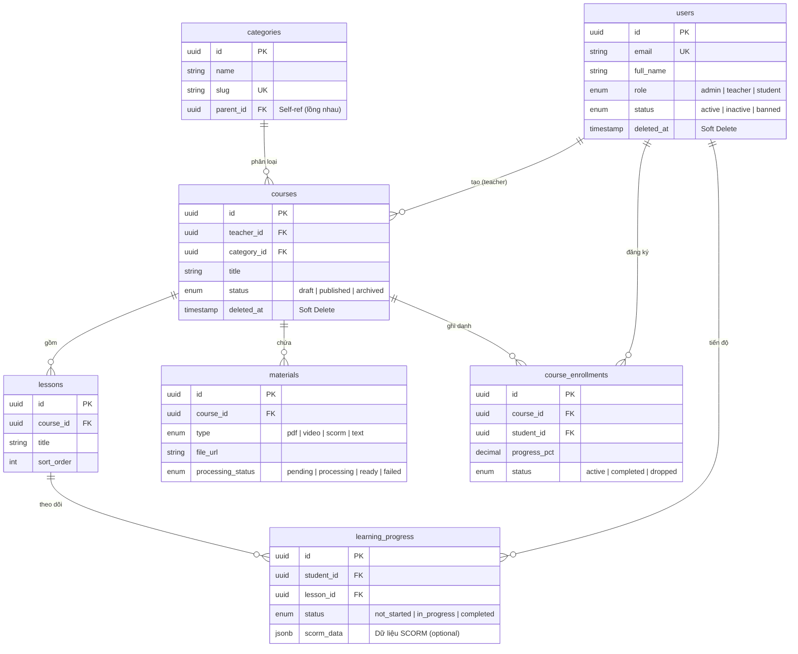
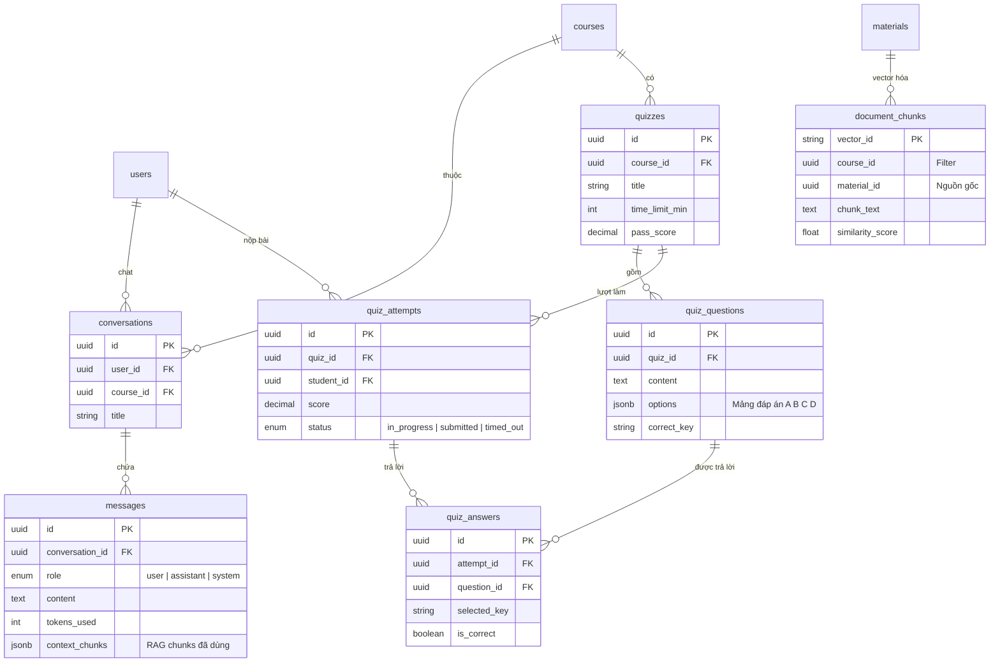
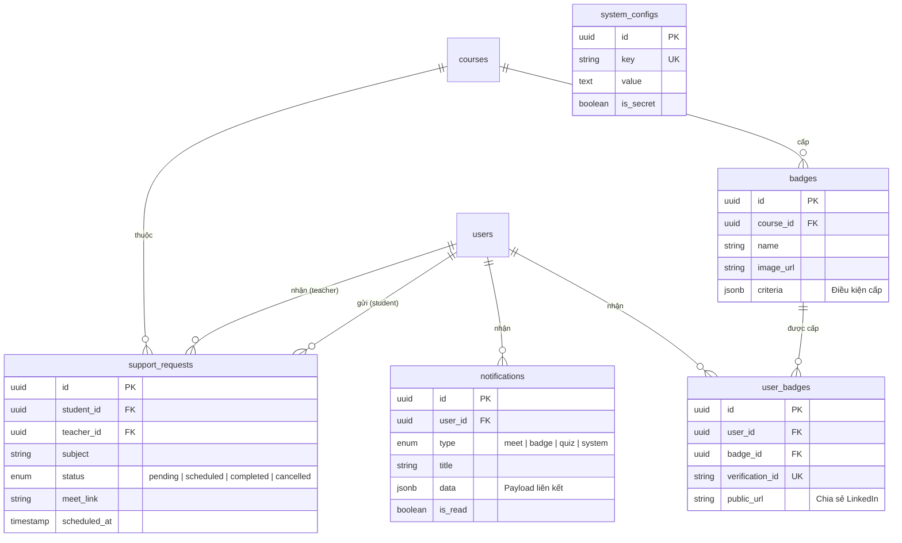

# 03 — THIẾT KẾ CƠ SỞ DỮ LIỆU (Database Schema)

**Dự án:** Hệ thống quản lý học tập trực tuyến (LMS) tích hợp Trợ lý AI hỗ trợ học tập.

> Tài liệu này mô tả chi tiết thiết kế các bảng SQL (PostgreSQL) và cấu trúc Vector DB — bám sát nghiệp vụ tại [01_business_requirements.md](./01_business_requirements.md) và kiến trúc tại [02_system_architecture.md](./02_system_architecture.md).

---

## 1. SƠ ĐỒ QUAN HỆ TỔNG QUAN (ER Diagram)

> Chia thành **3 nhóm** để dễ đọc. Mỗi sơ đồ tập trung vào 1 nhóm chức năng.

### 1.1 Nhóm: Quản lý Khóa học & Học tập



---

### 1.2 Nhóm: AI Chat & Thi cử



---

### 1.3 Nhóm: Hỗ trợ, Huy hiệu & Hệ thống



---

## 2. THIẾT KẾ CHI TIẾT CÁC BẢNG SQL (PostgreSQL)

> [!WARNING]
> **LƯU Ý QUAN TRỌNG VỀ SOFT DELETE VS CASCADE:**
> Hệ thống sử dụng cơ chế Soft Delete (`deleted_at IS NOT NULL`) cho bảng `users` và `courses`. Do đó, ràng buộc `ON DELETE CASCADE` trên cơ sở dữ liệu sẽ **KHÔNG** tự động kích hoạt khi thực hiện xóa mềm (chỉ chạy khi xóa vật lý `DELETE`).
> - **Nguyên tắc xử lý:** Tầng ứng dụng (Service/Repository Layer) phải tự đảm bảo việc cập nhật trạng thái hoặc `deleted_at` của các thực thể con phụ thuộc (như `lessons`, `materials`, `course_enrollments`) một cách đồng bộ khi thực hiện xóa mềm thực thể cha.
> - **Các câu query truy xuất:** Luôn phải lọc thêm điều kiện `deleted_at IS NULL` đối với thực thể cha.

### 2.1 Bảng `users` — Người dùng

Quản lý tất cả tài khoản trên hệ thống (Admin, Giảng viên, Học viên).

```sql
CREATE TABLE users (
    id              UUID PRIMARY KEY DEFAULT gen_random_uuid(),
    email           VARCHAR(255) NOT NULL UNIQUE,
    full_name       VARCHAR(255) NOT NULL,
    password_hash   VARCHAR(255) NOT NULL,
    avatar_url      VARCHAR(500),
    phone           VARCHAR(20),
    role            VARCHAR(20) NOT NULL DEFAULT 'student'
                    CHECK (role IN ('admin', 'teacher', 'student')),
    status          VARCHAR(20) NOT NULL DEFAULT 'active'
                    CHECK (status IN ('active', 'inactive', 'banned')),
    email_verified  BOOLEAN NOT NULL DEFAULT FALSE,
    last_login_at   TIMESTAMPTZ,
    created_at      TIMESTAMPTZ NOT NULL DEFAULT NOW(),
    updated_at      TIMESTAMPTZ NOT NULL DEFAULT NOW(),
    deleted_at      TIMESTAMPTZ              -- Soft Delete (NULL = chưa xóa)
);

CREATE INDEX idx_users_email ON users(email);
CREATE INDEX idx_users_role ON users(role);
CREATE INDEX idx_users_status ON users(status);
```

| Cột | Kiểu | Mô tả |
|-----|------|-------|
| `id` | UUID | Khóa chính, tự sinh |
| `email` | VARCHAR(255) | Email đăng nhập, duy nhất |
| `role` | VARCHAR(20) | `admin` / `teacher` / `student` |
| `status` | VARCHAR(20) | `active` / `inactive` / `banned` |
| `password_hash` | VARCHAR(255) | Bcrypt hash, KHÔNG lưu plaintext |

---

### 2.2 Bảng `categories` — Danh mục khóa học

```sql
CREATE TABLE categories (
    id          UUID PRIMARY KEY DEFAULT gen_random_uuid(),
    name        VARCHAR(255) NOT NULL,
    slug        VARCHAR(255) NOT NULL UNIQUE,
    description TEXT,
    parent_id   UUID REFERENCES categories(id) ON DELETE SET NULL,
    sort_order  INTEGER NOT NULL DEFAULT 0,
    created_at  TIMESTAMPTZ NOT NULL DEFAULT NOW(),
    updated_at  TIMESTAMPTZ NOT NULL DEFAULT NOW()
);

CREATE INDEX idx_categories_slug ON categories(slug);
CREATE INDEX idx_categories_parent ON categories(parent_id);
```

> **Lưu ý**: Hỗ trợ danh mục lồng nhau (nested) qua `parent_id` tự tham chiếu. Ví dụ: "Công nghệ thông tin" → "Lập trình Web" → "Python".

---

### 2.3 Bảng `courses` — Khóa học

```sql
CREATE TABLE courses (
    id              UUID PRIMARY KEY DEFAULT gen_random_uuid(),
    teacher_id      UUID NOT NULL REFERENCES users(id) ON DELETE CASCADE,
    category_id     UUID REFERENCES categories(id) ON DELETE SET NULL,
    title           VARCHAR(500) NOT NULL,
    slug            VARCHAR(500) NOT NULL UNIQUE,
    description     TEXT,
    thumbnail_url   VARCHAR(500),
    status          VARCHAR(20) NOT NULL DEFAULT 'draft'
                    CHECK (status IN ('draft', 'published', 'archived')),
    max_students    INTEGER,
    created_at      TIMESTAMPTZ NOT NULL DEFAULT NOW(),
    updated_at      TIMESTAMPTZ NOT NULL DEFAULT NOW(),
    deleted_at      TIMESTAMPTZ              -- Soft Delete (NULL = chưa xóa)
);

CREATE INDEX idx_courses_teacher ON courses(teacher_id);
CREATE INDEX idx_courses_category ON courses(category_id);
CREATE INDEX idx_courses_status ON courses(status);
CREATE INDEX idx_courses_slug ON courses(slug);

-- Full-text search tiếng Việt (GIN + unaccent)
CREATE EXTENSION IF NOT EXISTS unaccent;
CREATE INDEX idx_courses_search ON courses
    USING GIN (to_tsvector('simple', unaccent(title || ' ' || COALESCE(description, ''))));
```

| Cột | Mô tả |
|-----|-------|
| `teacher_id` | FK → `users.id` — Giảng viên sở hữu khóa học |
| `status` | `draft` (nháp) → `published` (công khai) → `archived` (lưu trữ) |
| `slug` | URL-friendly, dùng cho SEO |

---

### 2.4 Bảng `course_enrollments` — Ghi danh học viên

Bảng trung gian N:N giữa `users` (student) và `courses`.

```sql
CREATE TABLE course_enrollments (
    id              UUID PRIMARY KEY DEFAULT gen_random_uuid(),
    course_id       UUID NOT NULL REFERENCES courses(id) ON DELETE CASCADE,
    student_id      UUID NOT NULL REFERENCES users(id) ON DELETE CASCADE,
    enrolled_at     TIMESTAMPTZ NOT NULL DEFAULT NOW(),
    completed_at    TIMESTAMPTZ,
    progress_pct    DECIMAL(5,2) NOT NULL DEFAULT 0.00
                    CHECK (progress_pct >= 0 AND progress_pct <= 100),
    status          VARCHAR(20) NOT NULL DEFAULT 'active'
                    CHECK (status IN ('active', 'completed', 'dropped')),

    UNIQUE(course_id, student_id)
);

CREATE INDEX idx_enrollments_course ON course_enrollments(course_id);
CREATE INDEX idx_enrollments_student ON course_enrollments(student_id);
CREATE INDEX idx_enrollments_status ON course_enrollments(status);
```

> **Tại sao dùng bảng trung gian thay vì JSONB array?**
> - Cần query 2 chiều: "Học viên X đang học khóa nào?" và "Khóa Y có bao nhiêu học viên?"
> - Cần lưu metadata riêng cho từng enrollment (tiến độ, ngày ghi danh, trạng thái)
> - Hỗ trợ UNIQUE constraint tránh ghi danh trùng

---

### 2.5 Bảng `lessons` — Bài học

```sql
CREATE TABLE lessons (
    id          UUID PRIMARY KEY DEFAULT gen_random_uuid(),
    course_id   UUID NOT NULL REFERENCES courses(id) ON DELETE CASCADE,
    title       VARCHAR(500) NOT NULL,
    description TEXT,
    content     TEXT,                   -- Nội dung bài học dạng rich text / markdown
    sort_order  INTEGER NOT NULL DEFAULT 0,
    duration_minutes INTEGER,           -- Thời lượng ước tính (phút)
    is_published BOOLEAN NOT NULL DEFAULT FALSE,
    created_at  TIMESTAMPTZ NOT NULL DEFAULT NOW(),
    updated_at  TIMESTAMPTZ NOT NULL DEFAULT NOW()
);

CREATE INDEX idx_lessons_course ON lessons(course_id);
CREATE INDEX idx_lessons_sort ON lessons(course_id, sort_order);
```

---

### 2.6 Bảng `materials` — Tài liệu học tập

Lưu metadata file upload (PDF, Video, SCORM). File thực tế nằm trên Object Storage (MinIO/S3).

```sql
CREATE TABLE materials (
    id                  UUID PRIMARY KEY DEFAULT gen_random_uuid(),
    course_id           UUID NOT NULL REFERENCES courses(id) ON DELETE CASCADE,
    lesson_id           UUID REFERENCES lessons(id) ON DELETE SET NULL,
    uploaded_by         UUID NOT NULL REFERENCES users(id),
    title               VARCHAR(500) NOT NULL,
    type                VARCHAR(20) NOT NULL
                        CHECK (type IN ('pdf', 'video', 'scorm', 'text', 'other')),
    file_url            VARCHAR(1000) NOT NULL,     -- URL trên Object Storage
    file_size_bytes     BIGINT,
    mime_type           VARCHAR(100),
    processing_status   VARCHAR(20) NOT NULL DEFAULT 'pending'
                        CHECK (processing_status IN ('pending', 'processing', 'ready', 'failed')),
    processing_error    TEXT,                        -- Lỗi nếu xử lý thất bại
    chunk_count         INTEGER DEFAULT 0,           -- Số chunks đã vector hóa
    created_at          TIMESTAMPTZ NOT NULL DEFAULT NOW(),
    updated_at          TIMESTAMPTZ NOT NULL DEFAULT NOW()
);

CREATE INDEX idx_materials_course ON materials(course_id);
CREATE INDEX idx_materials_lesson ON materials(lesson_id);
CREATE INDEX idx_materials_status ON materials(processing_status);
CREATE INDEX idx_materials_type ON materials(type);
```

| Cột | Mô tả |
|-----|-------|
| `processing_status` | Vòng đời: `pending` → `processing` → `ready` / `failed` |
| `chunk_count` | Số lượng chunks đã được vector hóa (dùng để hiển thị tiến trình) |
| `file_url` | Đường dẫn trên MinIO/S3, KHÔNG lưu file trên PostgreSQL |

---

### 2.7 Bảng `conversations` — Cuộc hội thoại AI

Mỗi học viên có thể có nhiều cuộc hội thoại với AI, mỗi cuộc hội thoại gắn với 1 khóa học.

```sql
CREATE TABLE conversations (
    id          UUID PRIMARY KEY DEFAULT gen_random_uuid(),
    user_id     UUID NOT NULL REFERENCES users(id) ON DELETE CASCADE,
    course_id   UUID NOT NULL REFERENCES courses(id) ON DELETE CASCADE,
    title       VARCHAR(500),           -- Tóm tắt ngắn (có thể AI tự sinh)
    created_at  TIMESTAMPTZ NOT NULL DEFAULT NOW(),
    updated_at  TIMESTAMPTZ NOT NULL DEFAULT NOW()
);

CREATE INDEX idx_conversations_user ON conversations(user_id);
CREATE INDEX idx_conversations_course ON conversations(course_id);
CREATE INDEX idx_conversations_user_course ON conversations(user_id, course_id);
```

---

### 2.8 Bảng `messages` — Tin nhắn trong hội thoại

```sql
CREATE TABLE messages (
    id                  UUID PRIMARY KEY DEFAULT gen_random_uuid(),
    conversation_id     UUID NOT NULL REFERENCES conversations(id) ON DELETE CASCADE,
    role                VARCHAR(20) NOT NULL
                        CHECK (role IN ('user', 'assistant', 'system')),
    content             TEXT NOT NULL,
    tokens_used         INTEGER,                -- Số token LLM tiêu thụ
    model_name          VARCHAR(100),            -- Model đã dùng (gemini-2.0-flash, v.v.)
    context_chunks      JSONB,                   -- Các chunks RAG đã dùng làm context
    created_at          TIMESTAMPTZ NOT NULL DEFAULT NOW()
);

CREATE INDEX idx_messages_conversation ON messages(conversation_id);
CREATE INDEX idx_messages_created ON messages(conversation_id, created_at);
```

| Cột | Mô tả |
|-----|-------|
| `role` | `user` = câu hỏi học viên, `assistant` = câu trả lời AI, `system` = system prompt |
| `context_chunks` | JSONB lưu danh sách chunk_id + điểm similarity đã dùng để sinh câu trả lời (phục vụ debug & audit) |
| `tokens_used` | Tracking chi phí gọi LLM |

> **Tại sao dùng JSONB cho `context_chunks`?**
> Dữ liệu này có cấu trúc linh hoạt (số lượng chunks khác nhau mỗi lần), chỉ dùng để audit/debug, không cần query phức tạp → JSONB phù hợp hơn tạo bảng riêng.

---

### 2.9 Bảng `quizzes` — Bài thi trắc nghiệm

```sql
CREATE TABLE quizzes (
    id              UUID PRIMARY KEY DEFAULT gen_random_uuid(),
    course_id       UUID NOT NULL REFERENCES courses(id) ON DELETE CASCADE,
    title           VARCHAR(500) NOT NULL,
    description     TEXT,
    time_limit_min  INTEGER,                -- Giới hạn thời gian (phút), NULL = không giới hạn
    max_attempts    INTEGER DEFAULT 1,      -- Số lần làm tối đa
    pass_score      DECIMAL(5,2) NOT NULL DEFAULT 50.00,  -- Điểm đạt (%)
    shuffle_questions BOOLEAN NOT NULL DEFAULT FALSE,
    is_published    BOOLEAN NOT NULL DEFAULT FALSE,
    created_at      TIMESTAMPTZ NOT NULL DEFAULT NOW(),
    updated_at      TIMESTAMPTZ NOT NULL DEFAULT NOW()
);

CREATE INDEX idx_quizzes_course ON quizzes(course_id);
```

---

### 2.10 Bảng `quiz_questions` — Câu hỏi trắc nghiệm

```sql
CREATE TABLE quiz_questions (
    id          UUID PRIMARY KEY DEFAULT gen_random_uuid(),
    quiz_id     UUID NOT NULL REFERENCES quizzes(id) ON DELETE CASCADE,
    content     TEXT NOT NULL,               -- Nội dung câu hỏi
    options     JSONB NOT NULL,              -- Mảng các đáp án: [{"key":"A","text":"..."},...]
    correct_key VARCHAR(10) NOT NULL,        -- Đáp án đúng: "A", "B", "C", "D"
    explanation TEXT,                        -- Giải thích đáp án
    points      DECIMAL(5,2) NOT NULL DEFAULT 1.00,
    sort_order  INTEGER NOT NULL DEFAULT 0,
    created_at  TIMESTAMPTZ NOT NULL DEFAULT NOW()
);

CREATE INDEX idx_quiz_questions_quiz ON quiz_questions(quiz_id);
```

> **Tại sao dùng JSONB cho `options`?**
> Số lượng đáp án có thể thay đổi (3, 4, hoặc 5 phương án). JSONB cho phép linh hoạt mà không cần bảng `quiz_options` riêng — giảm số lượng JOIN khi render đề thi.

---

### 2.11 Bảng `quiz_attempts` — Lượt làm bài thi

```sql
CREATE TABLE quiz_attempts (
    id              UUID PRIMARY KEY DEFAULT gen_random_uuid(),
    quiz_id         UUID NOT NULL REFERENCES quizzes(id) ON DELETE CASCADE,
    student_id      UUID NOT NULL REFERENCES users(id) ON DELETE CASCADE,
    score           DECIMAL(5,2),           -- Điểm (%), NULL khi chưa nộp
    total_correct   INTEGER DEFAULT 0,
    total_questions INTEGER DEFAULT 0,
    started_at      TIMESTAMPTZ NOT NULL DEFAULT NOW(),
    submitted_at    TIMESTAMPTZ,            -- NULL = đang làm
    status          VARCHAR(20) NOT NULL DEFAULT 'in_progress'
                    CHECK (status IN ('in_progress', 'submitted', 'timed_out')),
    created_at      TIMESTAMPTZ NOT NULL DEFAULT NOW()
);

CREATE INDEX idx_attempts_quiz ON quiz_attempts(quiz_id);
CREATE INDEX idx_attempts_student ON quiz_attempts(student_id);
CREATE INDEX idx_attempts_quiz_student ON quiz_attempts(quiz_id, student_id);
```

---

### 2.12 Bảng `quiz_answers` — Câu trả lời chi tiết

```sql
CREATE TABLE quiz_answers (
    id              UUID PRIMARY KEY DEFAULT gen_random_uuid(),
    attempt_id      UUID NOT NULL REFERENCES quiz_attempts(id) ON DELETE CASCADE,
    question_id     UUID NOT NULL REFERENCES quiz_questions(id) ON DELETE CASCADE,
    selected_key    VARCHAR(10),            -- Đáp án học viên chọn
    is_correct      BOOLEAN,
    created_at      TIMESTAMPTZ NOT NULL DEFAULT NOW(),

    UNIQUE(attempt_id, question_id)
);

CREATE INDEX idx_answers_attempt ON quiz_answers(attempt_id);
```

---

### 2.13 Bảng `learning_progress` — Tiến độ học tập

Ghi nhận chi tiết từng bài học mà học viên đã hoàn thành.

```sql
CREATE TABLE learning_progress (
    id              UUID PRIMARY KEY DEFAULT gen_random_uuid(),
    student_id      UUID NOT NULL REFERENCES users(id) ON DELETE CASCADE,
    lesson_id       UUID NOT NULL REFERENCES lessons(id) ON DELETE CASCADE,
    course_id       UUID NOT NULL REFERENCES courses(id) ON DELETE CASCADE,
    status          VARCHAR(20) NOT NULL DEFAULT 'not_started'
                    CHECK (status IN ('not_started', 'in_progress', 'completed')),
    progress_pct    DECIMAL(5,2) NOT NULL DEFAULT 0.00,
    time_spent_sec  INTEGER NOT NULL DEFAULT 0,     -- Tổng thời gian học (giây)
    completed_at    TIMESTAMPTZ,
    last_accessed_at TIMESTAMPTZ NOT NULL DEFAULT NOW(),
    created_at      TIMESTAMPTZ NOT NULL DEFAULT NOW(),
    updated_at      TIMESTAMPTZ NOT NULL DEFAULT NOW(),

    UNIQUE(student_id, lesson_id)
);

CREATE INDEX idx_progress_student ON learning_progress(student_id);
CREATE INDEX idx_progress_course ON learning_progress(course_id);
CREATE INDEX idx_progress_student_course ON learning_progress(student_id, course_id);
```

> **Mối quan hệ với `course_enrollments.progress_pct`**: Khi `learning_progress` được cập nhật, hệ thống tính lại `progress_pct` tổng hợp trong `course_enrollments` = (số lessons completed / tổng lessons) × 100%.

---

### BẢNG MỚI: `scorm_attempts` — Lịch sử lượt học SCORM

Lưu lại lịch sử tương tác chi tiết cho từng lượt học (attempt) SCORM của học viên để hỗ trợ tính năng học lại (Retake) mà không làm mất lịch sử cũ.

```sql
CREATE TABLE scorm_attempts (
    id              UUID PRIMARY KEY DEFAULT gen_random_uuid(),
    student_id      UUID NOT NULL REFERENCES users(id) ON DELETE CASCADE,
    lesson_id       UUID NOT NULL REFERENCES lessons(id) ON DELETE CASCADE,
    attempt_number  INTEGER NOT NULL DEFAULT 1,
    status          VARCHAR(20) NOT NULL DEFAULT 'incomplete'
                    CHECK (status IN ('incomplete', 'completed', 'passed', 'failed')),
    score_raw       DECIMAL(5,2),                    -- Điểm số thô đạt được
    suspend_data    TEXT,                            -- suspend_data để khôi phục trạng thái SCORM
    scorm_data      JSONB,                           -- Toàn bộ data tracking chuẩn SCORM khác (cmi.core...)
    started_at      TIMESTAMPTZ NOT NULL DEFAULT NOW(),
    completed_at    TIMESTAMPTZ,
    created_at      TIMESTAMPTZ NOT NULL DEFAULT NOW(),

    UNIQUE(student_id, lesson_id, attempt_number)
);

CREATE INDEX idx_scorm_attempts_student_lesson ON scorm_attempts(student_id, lesson_id);
```

| Cột | Mô tả |
|-----|-------|
| `attempt_number` | Lượt học thứ mấy của học viên (1, 2, 3...) |
| `scorm_data` | JSONB lưu trữ dữ liệu SCORM chi tiết: `cmi.core.lesson_location`, `cmi.core.session_time`... |
| `status` | Trạng thái lượt học hiện tại của gói SCORM. |

> **Quy tắc đồng bộ tiến độ:** Khi một lượt học SCORM trong `scorm_attempts` chuyển sang trạng thái `completed` hoặc `passed`, hệ thống sẽ tự động cập nhật bản ghi tương ứng trong `learning_progress` của bài học đó thành `completed`.

---

### 2.14 Bảng `support_requests` — Yêu cầu hỗ trợ Google Meet

```sql
CREATE TABLE support_requests (
    id              UUID PRIMARY KEY DEFAULT gen_random_uuid(),
    student_id      UUID NOT NULL REFERENCES users(id) ON DELETE CASCADE,
    teacher_id      UUID NOT NULL REFERENCES users(id) ON DELETE CASCADE,
    course_id       UUID NOT NULL REFERENCES courses(id) ON DELETE CASCADE,
    subject         VARCHAR(500) NOT NULL,      -- Tiêu đề yêu cầu
    description     TEXT NOT NULL,              -- Mô tả chi tiết vấn đề
    status          VARCHAR(20) NOT NULL DEFAULT 'pending'
                    CHECK (status IN ('pending', 'scheduled', 'completed', 'cancelled')),
    meet_link       VARCHAR(500),               -- Link Google Meet (teacher điền)
    scheduled_at    TIMESTAMPTZ,                -- Thời gian hẹn
    resolution_note TEXT,                       -- Ghi chú giải pháp sau hỗ trợ
    created_at      TIMESTAMPTZ NOT NULL DEFAULT NOW(),
    updated_at      TIMESTAMPTZ NOT NULL DEFAULT NOW()
);

CREATE INDEX idx_support_student ON support_requests(student_id);
CREATE INDEX idx_support_teacher ON support_requests(teacher_id);
CREATE INDEX idx_support_status ON support_requests(status);
```

| Vòng đời | Mô tả |
|-----------|-------|
| `pending` | Học viên gửi yêu cầu, chờ giảng viên xử lý |
| `scheduled` | Giảng viên đã nhập link Meet + thời gian hẹn |
| `completed` | Đã hỗ trợ xong, có ghi chú giải pháp |
| `cancelled` | Hủy yêu cầu |

---

### 2.15 Bảng `badges` — Định nghĩa huy hiệu OpenBadges

```sql
CREATE TABLE badges (
    id              UUID PRIMARY KEY DEFAULT gen_random_uuid(),
    course_id       UUID NOT NULL REFERENCES courses(id) ON DELETE CASCADE,
    name            VARCHAR(255) NOT NULL,
    description     TEXT NOT NULL,
    image_url       VARCHAR(500) NOT NULL,      -- Hình ảnh huy hiệu
    criteria        JSONB NOT NULL,             -- Điều kiện cấp huy hiệu
    -- Ví dụ criteria: {"min_progress_pct": 100, "min_quiz_score": 80}
    issuer_name     VARCHAR(255) NOT NULL DEFAULT 'LMS AI System',
    created_at      TIMESTAMPTZ NOT NULL DEFAULT NOW()
);

CREATE INDEX idx_badges_course ON badges(course_id);
```

> **JSONB `criteria`**: Điều kiện cấp huy hiệu linh hoạt theo từng khóa học. Ví dụ:
> ```json
> {
>   "min_progress_pct": 100,
>   "min_quiz_score": 80,
>   "required_quizzes": ["quiz-uuid-1", "quiz-uuid-2"]
> }
> ```

---

### 2.16 Bảng `user_badges` — Huy hiệu đã cấp

```sql
CREATE TABLE user_badges (
    id              UUID PRIMARY KEY DEFAULT gen_random_uuid(),
    user_id         UUID NOT NULL REFERENCES users(id) ON DELETE CASCADE,
    badge_id        UUID NOT NULL REFERENCES badges(id) ON DELETE CASCADE,
    issued_at       TIMESTAMPTZ NOT NULL DEFAULT NOW(),
    verification_id VARCHAR(100) NOT NULL UNIQUE,   -- Mã xác minh công khai
    public_url      VARCHAR(500),                   -- Link public để chia sẻ LinkedIn
    metadata        JSONB,                          -- OpenBadges v2.0 JSON-LD assertion

    UNIQUE(user_id, badge_id)
);

CREATE INDEX idx_user_badges_user ON user_badges(user_id);
CREATE INDEX idx_user_badges_verification ON user_badges(verification_id);
```

---

### 2.17 Bảng `system_configs` — Cấu hình hệ thống

Cho phép Super Admin quản lý cấu hình runtime (API keys, rate limits...) mà không cần restart server.

```sql
CREATE TABLE system_configs (
    id          UUID PRIMARY KEY DEFAULT gen_random_uuid(),
    key         VARCHAR(255) NOT NULL UNIQUE,
    value       TEXT NOT NULL,
    description VARCHAR(500),
    is_secret   BOOLEAN NOT NULL DEFAULT FALSE,     -- Đánh dấu giá trị nhạy cảm
    updated_by  UUID REFERENCES users(id),
    created_at  TIMESTAMPTZ NOT NULL DEFAULT NOW(),
    updated_at  TIMESTAMPTZ NOT NULL DEFAULT NOW()
);

CREATE UNIQUE INDEX idx_system_configs_key ON system_configs(key);
```

Ví dụ dữ liệu:

| key | value | is_secret |
|-----|-------|-----------|
| `llm.api_key` | `AIza...` | ✅ TRUE |
| `llm.model_name` | `gemini-2.0-flash` | FALSE |
| `chat.max_messages_per_day` | `50` | FALSE |
| `chat.rate_limit_per_minute` | `10` | FALSE |

---

## 3. THIẾT KẾ VECTOR DATABASE (Qdrant / ChromaDB)

### 3.1 Collection: `document_chunks`

Lưu trữ các chunks tài liệu đã được embedding, phục vụ RAG pipeline.

```
Collection: document_chunks
├── Vector: 768 dimensions (Gemini Embedding)
│           hoặc 384 dimensions (all-MiniLM-L6-v2)
├── Distance Metric: Cosine Similarity
└── Payload (metadata):
    ├── course_id      (UUID)     — Filter theo khóa học
    ├── material_id    (UUID)     — Truy xuất nguồn gốc
    ├── lesson_id      (UUID)     — Filter theo bài học (optional)
    ├── chunk_index    (Integer)  — Thứ tự chunk trong tài liệu
    ├── chunk_text     (String)   — Nội dung text gốc của chunk
    ├── source_title   (String)   — Tên tài liệu gốc
    └── created_at     (String)   — Thời điểm vector hóa
```

### 3.2 Chiến lược Chunking

```
┌──────────────────────────────────────────────┐
│              Tài liệu PDF gốc               │
│  (VD: "Giáo trình OOP - 50 trang")          │
└──────────────────┬───────────────────────────┘
                   │
                   ▼
┌──────────────────────────────────────────────┐
│           Chunking Strategy                  │
│  • Chunk size: 500-1000 tokens               │
│  • Overlap: 100-200 tokens (tránh mất ngữ cảnh)│
│  • Split by: Paragraph → Sentence fallback   │
└──────────────────┬───────────────────────────┘
                   │
          ┌────────┼────────┐
          ▼        ▼        ▼
      ┌───────┐ ┌───────┐ ┌───────┐
      │Chunk 1│ │Chunk 2│ │Chunk 3│  ...
      │500 tok│ │500 tok│ │500 tok│
      └───┬───┘ └───┬───┘ └───┬───┘
          │        │        │
          ▼        ▼        ▼
      ┌───────┐ ┌───────┐ ┌───────┐
      │Vec [1]│ │Vec [2]│ │Vec [3]│  → Lưu vào Vector DB
      │768-dim│ │768-dim│ │768-dim│
      └───────┘ └───────┘ └───────┘
```

### 3.3 Query Flow (Similarity Search)

```sql
-- Pseudo-query khi học viên hỏi "OOP là gì?" trong khóa học X:

SELECT chunk_text, similarity_score
FROM document_chunks
WHERE course_id = 'khóa-học-X-uuid'          -- Filter đúng khóa học
ORDER BY vector <=> embed('OOP là gì?')       -- Cosine similarity
LIMIT 5;                                      -- Top 5 chunks liên quan nhất
```

---

## 4. CẤU TRÚC DỮ LIỆU REDIS

Redis phục vụ 4 mục đích chính trong hệ thống:

### 4.1 Rate Limiting (Token Bucket) & Daily Quota

#### A. Rate Limiting (Chống spam)
```
Key:    rate_limit:user:{user_id}
Type:   String (counter)
TTL:    60 seconds (tự reset mỗi phút)
Value:  Số request còn lại

Key:    rate_limit:ip:{ip_address}
Type:   String (counter)
TTL:    60 seconds
Value:  Số request còn lại (cho endpoint public)
```

#### B. Daily AI Chat Quota (Giới hạn lượt chat AI theo ngày)
```
Key:    quota:ai:user:{user_id}:{YYYY-MM-DD}
Type:   String (counter)
TTL:    86400 seconds (24h - tự động hết hạn sau 1 ngày)
Value:  Số lượt chat đã thực hiện (tối đa 50)
```

### 4.2 JWT Blacklist (Logout & Refresh Token Rotation)

```
Key:    blacklist:token:{jti}
Type:   String
TTL:    = Thời gian còn lại của token (Access hoặc Refresh Token cũ sau khi xoay vòng)
Value:  "1" (chỉ cần tồn tại là đủ)
```

### 4.3 Job Queue (Document Processing)

```
Key:    queue:document_processing
Type:   List (FIFO)
Value:  JSON payload:
        {
            "material_id": "uuid",
            "course_id": "uuid",
            "file_url": "s3://...",
            "file_type": "pdf",
            "retry_count": 0
        }
```

### 4.4 Password Reset Token

```
Key:    password_reset:{token_hash}
Type:   String
TTL:    900 seconds (15 phút)
Value:  user_id (UUID của người dùng yêu cầu reset)
```

> **Không tạo bảng SQL** cho password reset — Redis tự cleanup khi token hết hạn.

---

## 5. MIGRATION STRATEGY (Alembic)

### 5.1 Cấu trúc thư mục Migrations

```
backend/
└── migrations/
    ├── env.py                          # Cấu hình Alembic
    ├── alembic.ini                     # Config file
    └── versions/
        ├── 001_create_users.py
        ├── 002_create_categories_courses.py
        ├── 003_create_lessons_materials.py
        ├── 004_create_conversations_messages.py
        ├── 005_create_quizzes.py
        ├── 006_create_progress_support.py
        ├── 007_create_badges.py
        ├── 008_create_system_configs.py
        └── 009_create_notifications.py
```

### 5.2 Quy tắc Migration

| Quy tắc | Mô tả |
|---------|--------|
| **Không dùng AutoMigrate** | Production chỉ dùng Alembic versioned migrations |
| **Mỗi migration 1 mục đích** | Tách riêng DDL (schema) và DML (data seed) |
| **Luôn có rollback** | Mỗi `upgrade()` phải có `downgrade()` tương ứng |
| **Test trước khi merge** | Chạy `alembic upgrade head` + `alembic downgrade -1` trên môi trường test |

---

## 6. TÓM TẮT CÁC BẢNG

| # | Bảng | Số cột | Quan hệ chính | Mục đích |
|---|------|--------|----------------|----------|
| 1 | `users` | 12 | — | Tài khoản 3 role |
| 2 | `categories` | 6 | Self-ref | Danh mục lồng nhau |
| 3 | `courses` | 10 | → users, categories | Khóa học |
| 4 | `course_enrollments` | 7 | → courses, users | Ghi danh N:N |
| 5 | `lessons` | 9 | → courses | Bài học |
| 6 | `materials` | 13 | → courses, lessons | Tài liệu + trạng thái vector hóa |
| 7 | `conversations` | 5 | → users, courses | Cuộc hội thoại AI |
| 8 | `messages` | 7 | → conversations | Tin nhắn chat |
| 9 | `quizzes` | 10 | → courses | Bài thi |
| 10 | `quiz_questions` | 8 | → quizzes | Câu hỏi trắc nghiệm |
| 11 | `quiz_attempts` | 9 | → quizzes, users | Lượt làm bài |
| 12 | `quiz_answers` | 5 | → attempts, questions | Câu trả lời |
| 13 | `learning_progress` | 9 | → users, lessons, courses | Tiến độ (không lưu SCORM data) |
| 14 | `support_requests` | 11 | → users (×2), courses | Hỗ trợ Google Meet |
| 15 | `badges` | 7 | → courses | Huy hiệu |
| 16 | `user_badges` | 6 | → users, badges | Huy hiệu đã cấp |
| 17 | `system_configs` | 7 | → users | Cấu hình runtime |
| 18 | `notifications` | 9 | → users | Thông báo real-time |
| 19 | `scorm_attempts` | 11 | → users, lessons | Lịch sử tương tác SCORM |

**Tổng: 19 bảng SQL + 1 Vector DB collection + 5 Redis key patterns**

---

## BẢNG MỚI: `notifications` — Thông báo

Lưu tất cả thông báo để hiển thị trong giao diện (icon chuông) và đẩy qua WebSocket.

```sql
CREATE TABLE notifications (
    id          UUID PRIMARY KEY DEFAULT gen_random_uuid(),
    user_id     UUID NOT NULL REFERENCES users(id) ON DELETE CASCADE,
    type        VARCHAR(50) NOT NULL
                CHECK (type IN (
                    'meet_scheduled', 'material_ready', 'badge_earned',
                    'quiz_graded', 'support_reply', 'system'
                )),
    title       VARCHAR(500) NOT NULL,
    message     TEXT,
    data        JSONB,                      -- Payload liên kết (course_id, meet_link...)
    is_read     BOOLEAN NOT NULL DEFAULT FALSE,
    created_at  TIMESTAMPTZ NOT NULL DEFAULT NOW()
);

CREATE INDEX idx_notifications_user ON notifications(user_id);
CREATE INDEX idx_notifications_user_read ON notifications(user_id, is_read);
CREATE INDEX idx_notifications_created ON notifications(user_id, created_at DESC);
```

| Cột | Mô tả |
|-----|-------|
| `type` | Loại thông báo: `meet_scheduled`, `badge_earned`, `quiz_graded`... |
| `data` | JSONB chứa metadata liên kết (ví dụ: `{"course_id": "...", "meet_link": "..."}`) |
| `is_read` | Đánh dấu đã đọc / chưa đọc |

---

*Tài liệu liên quan:*
- *[01_business_requirements.md](./01_business_requirements.md) — Đặc tả nghiệp vụ*
- *[02_system_architecture.md](./02_system_architecture.md) — Kiến trúc hệ thống*
